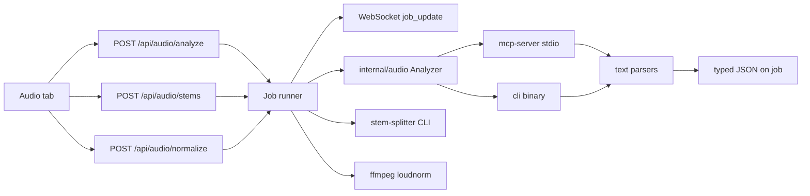

# Audio Tools Implementation Plan

> **For agentic workers:** REQUIRED SUB-SKILL: Use superpowers:subagent-driven-development (recommended) or superpowers:executing-plans to implement this plan task-by-task. Steps use checkbox (`- [ ]`) syntax for tracking.

After approval, also save this plan to [`docs/superpowers/plans/2026-09-11-audio-tools.md`](docs/superpowers/plans/2026-09-11-audio-tools.md).

**Goal:** Let BeatportDL-UI analyze local audio files, split them into 4 stems, and loudness-normalize them, with progress in Queue.

**Architecture:** New `internal/audio` package owns subprocesses and parsers. HTTP handlers enqueue in-memory jobs (same `Job` map as downloads) and stream WebSocket progress. The UI is one new top-bar **Audio** tab with three panels sharing a directory/file picker. Analysis never links the Rust library; it calls `mcp-server` or `cli` and parses their formatted text into Go structs. Stems use the `stem-splitter` CLI from crate `stem-splitter-core` 1.2.0 (ONNX Runtime: CoreML on darwin/arm64, XNNPACK/CPU on darwin/amd64). Normalize uses two-pass ffmpeg `loudnorm` (ffmpeg is already a project dependency).

**Tech Stack:** Go 1.22, vanilla `web/` (HTML/CSS/JS), ffmpeg, audio-analyzer-rs (existing submodule), stem-splitter-core (Cargo-installed CLI, not a Cursor MCP).

## Global Constraints

- Go 1.22 monolith; no frontend bundler; edit [`web/index.html`](web/index.html), [`web/css/style.css`](web/css/style.css), [`web/js/app.js`](web/js/app.js) directly.
- Propagate `context.Context` as first argument through `internal/audio` (use `r.Context()` in handlers; `context.WithoutCancel(r.Context())` when spawning background jobs that must outlive the HTTP request).
- Verify with `go test ./internal/audio/...` and `go build ./...`. This repo has no `*_test.go` yet — introduce stdlib table-driven tests only (do not add testify).
- Do **not** commit unless the user explicitly asks (user rule overrides writing-plans frequent-commit steps).
- Do **not** add or enable any new Cursor MCP server. The Go app spawns local binaries. Existing [`.cursor/mcp.json`](.cursor/mcp.json) audio-analyzer entry is already a non-Runlayer (shadow) MCP for Cursor agents only; leave it unchanged.
- Do **not** patch `third_party/audio-analyzer-rs` to emit JSON. Parse its formatted text (user requirement).
- Escape all user/API strings with `escHtml()` in the UI.
- Top nav stays a top bar: Search | Download | Queue | Fix Tags | **Audio** | Settings.

## Decisions already made

- **UI:** one Audio tab, three panels (Analyze / Stems / Normalize), Queue for long jobs.
- **Stems:** Rust `stem-splitter` (HT-Demucs ONNX). No Python, no PyTorch. Apple Silicon default = CoreML; Intel = auto XNNPACK then CPU. User can override in Settings.
- **Analyze kinds:** `audio_info`, `spectral_features`, `harmonic_analysis`, `rhythm_analysis`, `full_analysis` (skip MCP `compare` — not requested).
- **Normalize:** EBU R128 two-pass ffmpeg loudnorm. Default I=-14 LUFS, TP=-1.5 dBTP, LRA=11. Sidecar files by default (`*_normalized.ext`); optional overwrite.

## File map

- Create: `internal/audio/types.go` — analysis DTOs and request/result types
- Create: `internal/audio/files.go` — list `.flac/.m4a/.mp3/.wav/.ogg/.aac` under a path
- Create: `internal/audio/parse.go` + `parse_test.go` + `testdata/*.txt` — text → structs
- Create: `internal/audio/exec.go` — `CommandContext` helper
- Create: `internal/audio/mcp.go` — stdio MCP JSON-RPC client
- Create: `internal/audio/cli.go` — analyzer CLI runner
- Create: `internal/audio/analyzer.go` — backend dispatch (`auto|mcp|cli`)
- Create: `internal/audio/normalize.go` + `normalize_test.go` — ffmpeg loudnorm
- Create: `internal/audio/stems.go` — stem-splitter subprocess + arch defaults
- Create: `internal/server/audio_handlers.go` — HTTP + job runners (keep [`handlers.go`](internal/server/handlers.go) from growing)
- Modify: [`internal/config/config.go`](internal/config/config.go) — new YAML fields
- Modify: [`internal/server/ws.go`](internal/server/ws.go) + [`internal/server/handlers.go`](internal/server/handlers.go) `Job` / `JobPayload`
- Modify: [`internal/server/server.go`](internal/server/server.go) — new routes
- Modify: [`web/index.html`](web/index.html), [`web/js/app.js`](web/js/app.js), [`web/css/style.css`](web/css/style.css)
- Modify: [`Makefile`](Makefile), [`README.md`](README.md)
- Create: `.claude/skills/audio-tools/SKILL.md`



---

### Task 1: Analysis types and text parsers (TDD)

**Files:**
- Create: `internal/audio/types.go`
- Create: `internal/audio/parse.go`
- Create: `internal/audio/parse_test.go`
- Create: `internal/audio/testdata/audio_info.txt`
- Create: `internal/audio/testdata/spectral_features.txt`
- Create: `internal/audio/testdata/harmonic_analysis.txt`
- Create: `internal/audio/testdata/rhythm_analysis.txt`
- Create: `internal/audio/testdata/full_analysis.txt`
- Create: `internal/audio/testdata/cli_full.txt`

**Interfaces:**
- Consumes: formatted stdout from audio-analyzer-rs MCP tools and CLI (see [`third_party/audio-analyzer-rs/src/mcp_server.rs`](third_party/audio-analyzer-rs/src/mcp_server.rs) format strings around lines 318, 446, 687, 796, 1017 and [`src/main.rs`](third_party/audio-analyzer-rs/src/main.rs))
- Produces: `Parse(kind, text) (Analysis, error)` and typed structs later tasks JSON-encode

Copy real sample blobs into `testdata/` from the analyzer README / MCP format strings (do not invent field names). CLI dump uses slightly different labels (`Duration:    {:.2} seconds` vs MCP `Duration: {:.2} seconds`) — parsers must accept both.

- [ ] **Step 1: Write failing tests**

```go
package audio_test

func TestParse_AudioInfo(t *testing.T) {
    t.Parallel()
    raw := readTestdata(t, "audio_info.txt")
    got, err := audio.Parse(audio.KindAudioInfo, raw)
    if err != nil {
        t.Fatal(err)
    }
    if got.AudioInfo.SampleRate != 48000 {
        t.Fatalf("sample rate: got %d", got.AudioInfo.SampleRate)
    }
    if got.AudioInfo.DurationSec < 60 || got.AudioInfo.DurationSec > 61 {
        t.Fatalf("duration: got %v", got.AudioInfo.DurationSec)
    }
}
```

Add equivalent tests for the other four kinds plus `TestParse_CLIFullDump_ExtractsAllSections` (CLI always prints a combined dump; `Parse(KindFullAnalysis, cliText)` must fill every nested struct). Include a failure case: empty input returns an error.

- [ ] **Step 2: Run tests — expect FAIL** (`audio.Parse` undefined)

```bash
go test ./internal/audio/ -count=1
```

- [ ] **Step 3: Implement types + parsers**

`internal/audio/types.go` (exact names; later tasks depend on these):

```go
package audio

const (
    KindAudioInfo          = "audio_info"
    KindSpectralFeatures   = "spectral_features"
    KindHarmonicAnalysis   = "harmonic_analysis"
    KindRhythmAnalysis     = "rhythm_analysis"
    KindFullAnalysis       = "full_analysis"
)

type Analysis struct {
    Kind              string             `json:"kind"`
    Source            string             `json:"source"` // "mcp" | "cli"
    Path              string             `json:"path,omitempty"`
    RawText           string             `json:"raw_text,omitempty"`
    AudioInfo         *AudioInfo         `json:"audio_info,omitempty"`
    SpectralFeatures  *SpectralFeatures  `json:"spectral_features,omitempty"`
    HarmonicAnalysis  *HarmonicAnalysis  `json:"harmonic_analysis,omitempty"`
    RhythmAnalysis    *RhythmAnalysis    `json:"rhythm_analysis,omitempty"`
    Percussive        *Percussive        `json:"percussive,omitempty"`
    Sections          []SectionBoundary  `json:"sections,omitempty"`
}

type AudioInfo struct {
    Path       string  `json:"path"`
    SampleRate int     `json:"sample_rate"`
    Samples    int64   `json:"samples"`
    DurationSec float64 `json:"duration_sec"`
}

type SpectralFeatures struct {
    CentroidHz     float64            `json:"centroid_hz"`
    BandwidthHz    float64            `json:"bandwidth_hz"`
    RolloffHz      float64            `json:"rolloff_hz"`
    Flatness       float64            `json:"flatness"`
    RMSEnergy      float64            `json:"rms_energy"`
    ZeroCrossingRate float64          `json:"zero_crossing_rate"`
    MFCCs          []float64          `json:"mfccs"`
    BandEnergy     map[string]float64 `json:"band_energy"`
    SpectralContrast map[string]float64 `json:"spectral_contrast"`
    PeakDBFS       float64            `json:"peak_dbfs"`
    CrestFactorDB  float64            `json:"crest_factor_db"`
    LoudnessRangeDB float64           `json:"loudness_range_db"`
    LUFSIntegrated float64            `json:"lufs_integrated"`
    TruePeakDBTP   float64            `json:"true_peak_dbtp"`
    LRA            float64            `json:"lra"`
    Stereo         *StereoField       `json:"stereo,omitempty"`
}

type StereoField struct {
    PhaseCorrAvg       float64 `json:"phase_corr_avg"`
    PhaseCorrMin       float64 `json:"phase_corr_min"`
    StereoWidthAvg     float64 `json:"stereo_width_avg"`
    Balance            float64 `json:"balance"`
    MonoCompatibility  float64 `json:"mono_compatibility"`
}

type HarmonicAnalysis struct {
    Key        string      `json:"key"`
    Mode       string      `json:"mode"`
    Confidence float64     `json:"confidence"`
    PitchClasses []PitchClass `json:"pitch_classes"`
}

type PitchClass struct {
    Name  string  `json:"name"`
    Value float64 `json:"value"`
}

type RhythmAnalysis struct {
    TempoBPM     float64   `json:"tempo_bpm"`
    Confidence   float64   `json:"confidence"`
    BeatsDetected int      `json:"beats_detected"`
    MeanTempoBPM float64   `json:"mean_tempo_bpm"`
    MedianTempoBPM float64 `json:"median_tempo_bpm"`
    Stability    float64   `json:"stability"`
    BeatTimesSec []float64 `json:"beat_times_sec,omitempty"`
}

type Percussive struct {
    PercussiveRatio float64 `json:"percussive_ratio"`
    OnsetDensity    float64 `json:"onset_density"`
    PeakAttackSharp float64 `json:"peak_attack_sharp"`
}

type SectionBoundary struct {
    TimeSec    float64 `json:"time_sec"`
    Reasons    string  `json:"reasons"`
    Confidence float64 `json:"confidence"`
}
```

`Parse` uses `regexp` + line scanners. Extract numbers with patterns like:

- `Sample rate:\s+(\d+)\s*Hz`
- `Duration:\s+([\d.]+)\s+seconds?` and `Duration:\s+([\d.]+)\s+sec`
- `Estimated Key:\s+(\S+)\s+(\w+)\s+\(confidence:\s+([\d.]+)\)`
- `Estimated Tempo:\s+([\d.]+)\s+BPM\s+\(confidence:\s+([\d.]+)\)`
- `Integrated:\s+([-\d.]+)\s+LUFS`

For `full_analysis` / CLI dumps, split on `──` section headers and reuse the per-kind scanners. Unknown extra lines (masking, TSV time-series) are ignored, not errors. Always keep `RawText`.

- [ ] **Step 4: Tests pass**

```bash
go test ./internal/audio/ -count=1
```

Expected: PASS

---

### Task 2: Analyzer backends (MCP + CLI)

**Files:**
- Create: `internal/audio/exec.go`
- Create: `internal/audio/mcp.go`
- Create: `internal/audio/cli.go`
- Create: `internal/audio/analyzer.go`
- Create: `internal/audio/analyzer_test.go`
- Create: `internal/audio/files.go`
- Create: `internal/audio/files_test.go`

**Interfaces:**
- Consumes: `Parse`, binary paths from config
- Produces:
  - `ListAudioFiles(ctx, path string) ([]string, error)` — if path is a file, return `[path]`; if directory, walk one level (not recursive) for audio extensions
  - `type Backend string` with `BackendAuto`, `BackendMCP`, `BackendCLI`
  - `func Analyze(ctx context.Context, req AnalyzeRequest) (Analysis, error)`

```go
type AnalyzeRequest struct {
    Path    string
    Kind    string // one of Kind*
    Backend string // auto|mcp|cli
    MCPPath string
    CLIPath string
}
```

**Binary resolution** (`ResolveAnalyzerBins` in `analyzer.go`):

1. Use `req.MCPPath` / `req.CLIPath` if non-empty and executable
2. Else look next to the running binary (`os.Executable()` dir)
3. Else repo-relative `third_party/audio-analyzer-rs/target/release/mcp-server` and `.../cli`
4. Else `exec.LookPath("mcp-server")` / `LookPath("audio-analyzer-mcp")` / `LookPath("cli")` / `LookPath("audio-analyzer")`

`auto`: try MCP first; on spawn/init failure, fall back to CLI. CLI cannot call individual tools — it always runs the full dump. When `BackendCLI` or CLI fallback and `Kind != full_analysis`, still run CLI once and `Parse` the requested kind (plus always attach parsed full fields when kind is `full_analysis`).

**MCP client:** spawn `mcp-server` with `exec.CommandContext`, stdin/stdout pipes, stderr to slog. Probe framing once (rmcp stdio): implement Content-Length (same as [`cmd/mcp-server/main.go`](cmd/mcp-server/main.go) `readMessage`/`writeMessage`) and if the first read fails, retry NDJSON. Handshake:

1. `initialize` with `protocolVersion: "2024-11-05"`, `clientInfo: {name: "beatportdl-ui"}`
2. notification `notifications/initialized`
3. `tools/call` with `{name, arguments: {path}}`

Read `result.content[].text` (MCP text content). Parse with `Parse`. Kill the process when `ctx` is done. For a directory job (Task 4), reuse one MCP process for all files (initialize once).

**Fake-exec tests:** do not spawn real binaries in unit tests. Inject a `var lookPath` / `runCmd` function vars. Tests feed canned stdout (from testdata) and assert `Analyze` returns parsed structs. A second test asserts CLI fallback when MCP start returns error.

**ListAudioFiles tests:** temp dir with `a.flac`, `b.txt`, `sub/c.mp3` — expect only `a.flac` (non-recursive). File path passthrough test.

```bash
go test ./internal/audio/ -count=1
```

---

### Task 3: Job kind + audio HTTP plumbing

**Files:**
- Modify: [`internal/server/handlers.go`](internal/server/handlers.go) `Job` struct (~line 38)
- Modify: [`internal/server/ws.go`](internal/server/ws.go) `JobPayload` (~line 69)
- Modify: [`internal/server/server.go`](internal/server/server.go)
- Create: `internal/server/audio_handlers.go`
- Modify: [`internal/config/config.go`](internal/config/config.go)

**Interfaces:**
- Consumes: `audio.Analyze`, `audio.ListAudioFiles`
- Produces: `POST /api/audio/analyze` → `202 {job_id}`; job payload includes `kind` and `analysis` on completion

Extend `Job`:

```go
Kind      string          // "download" (default), "analyze", "stems", "normalize"
Message   string
Analysis  []audio.Analysis // analyze jobs only
StemFiles []string
```

`JobPayload` adds `kind`, `kind_label`, and `analysis` (omit empty). Existing download jobs set `Kind: "download"` in `handleDownload` so the Queue can badge them. Empty-state copy in JS later: "No jobs yet".

Config fields (defaults in `applyDefaults`):

```go
AudioAnalyzerBackend string  `yaml:"audio_analyzer_backend" json:"audio_analyzer_backend"` // auto
AudioAnalyzerMCPPath string  `yaml:"audio_analyzer_mcp_path" json:"audio_analyzer_mcp_path"`
AudioAnalyzerCLIPath string  `yaml:"audio_analyzer_cli_path" json:"audio_analyzer_cli_path"`
StemSplitterPath     string  `yaml:"stem_splitter_path" json:"stem_splitter_path"`
StemProvider         string  `yaml:"stem_provider" json:"stem_provider"` // auto
NormalizeTargetLUFS  float64 `yaml:"normalize_target_lufs" json:"normalize_target_lufs"` // -14
NormalizeTruePeak    float64 `yaml:"normalize_true_peak" json:"normalize_true_peak"`     // -1.5
NormalizeLRA         float64 `yaml:"normalize_lra" json:"normalize_lra"`                 // 11
```

If `NormalizeTargetLUFS == 0`, default to `-14` (zero is not a valid "unset" for a negative default — use a pointer **or** treat `== 0` as unset in `applyDefaults` only; prefer `applyDefaults`: if `NormalizeTargetLUFS == 0 { = -14 }` and document that 0 cannot be chosen).

Routes in `Mount`:

```go
mux.HandleFunc("GET /api/audio/tools", s.handleAudioTools)
mux.HandleFunc("POST /api/audio/analyze", s.handleAudioAnalyze)
```

`GET /api/audio/tools` reports which binaries/ffmpeg are found (for the Audio tab banner). Uses `r.Context()`.

`handleAudioAnalyze`:

1. Decode `{path, kind, backend}` — `path` may be file or directory; empty path → `cfg.OutputDir`
2. Validate `kind` against the five constants; default `full_analysis`
3. `ListAudioFiles`; 400 if none
4. Create `Job{Kind:"analyze", Name: filepath.Base(path), Total: len(files)}`
5. `go s.runAnalyzeJob(context.WithoutCancel(r.Context()), job, files, kind, backend, cfgCopy)`
6. `202 {"job_id"}`

`runAnalyzeJob`: for each file, `audio.Analyze(ctx, ...)`, append to `job.Analysis`, increment Completed/Failed, `broadcastJob`. Timeout per file: 2 minutes via `context.WithTimeout`. Log with slog.

Reuse `broadcastJob` / `failJob`. Per-file progress can reuse `ProgressPayload` with `TrackTitle` = filename.

No handler unit tests yet (no test server in repo). Manual: `go build ./...`.

---

### Task 4: Audio tab UI — Analyze panel

**Files:**
- Modify: [`web/index.html`](web/index.html) — nav button after Fix Tags; `#view-audio`
- Modify: [`web/css/style.css`](web/css/style.css) — reuse `.fix-card` / `.fix-dir-row`; add `.audio-tabs`, `.analysis-card`
- Modify: [`web/js/app.js`](web/js/app.js) — `initAudio`, WS `job_update` already works; render analysis JSON; Queue badge for analyze jobs

Nav: `data-view="audio"` → `#view-audio`. Sub-tabs (not top nav): Analyze | Stems | Normalize. Shared `#audio-path-input` (file or directory), placeholder "Leave empty to use output folder from settings".

Analyze panel:

- Select: analysis kind (five options; default Full analysis)
- Select: backend Auto / MCP / CLI
- Button "Analyze" → `POST /api/audio/analyze`
- Results: for the latest analyze job, render a readable card (key, BPM, LUFS, duration) plus a collapsible `<pre>` of `JSON.stringify(analysis, null, 2)`
- On load, `GET /api/audio/tools` — if neither analyzer binary exists, show a warning with `make audio-analyzer-mcp && make audio-analyzer-cli`

Queue: `jobCardHTML` shows a kind chip (`Download` / `Analyze` / `Stems` / `Normalize`). Empty state: "No jobs yet".

On `job_update` for `kind === 'analyze'` while Audio tab is open, refresh the analysis result pane.

Escape all paths and analysis strings with `escHtml()`.

Verify in the browser (user rule): open http://localhost:8989, click Audio, run analyze on a real file if binaries exist; otherwise confirm the missing-binary banner and that Search/Fix Tags still work.

```bash
go build ./...
go run . -no-open
```

---

### Task 5: Normalize (ffmpeg loudnorm)

**Files:**
- Create: `internal/audio/normalize.go`
- Create: `internal/audio/normalize_test.go`
- Modify: `internal/server/audio_handlers.go`
- Modify: [`internal/server/server.go`](internal/server/server.go)
- Modify: [`web/index.html`](web/index.html), [`web/js/app.js`](web/js/app.js)

**Interfaces:**
- Consumes: ffmpeg on PATH (already required)
- Produces: `Normalize(ctx, NormalizeRequest) (NormalizeResult, error)`

```go
type NormalizeRequest struct {
    Input      string
    Output     string // empty → sidecar: name_normalized + ext
    TargetLUFS float64
    TruePeak   float64
    LRA        float64
    Overwrite  bool
}

type NormalizeResult struct {
    Input      string  `json:"input"`
    Output     string  `json:"output"`
    MeasuredI  float64 `json:"measured_i"`
    MeasuredTP float64 `json:"measured_tp"`
    MeasuredLRA float64 `json:"measured_lra"`
}
```

Two-pass:

1. `ffmpeg -nostdin -i input -af loudnorm=I={I}:TP={TP}:LRA={LRA}:print_format=json -f null -`
2. Parse the JSON object from stderr (ffmpeg prints it after `loudnorm` logs). Tests feed a canned stderr blob — inject `runCmd`.
3. Second pass: same filter with `measured_I`, `measured_TP`, `measured_LRA`, `measured_thresh`, `offset`, `linear=true`. Keep codec: FLAC stays FLAC (`-c:a flac`), M4A stays AAC (`-c:a aac -b:a 256k`), else `-c:a flac` for wav/mp3 sidecar as `.flac` **or** copy container: match input ext using `-c:a flac` only for `.flac`, `-c:a aac` for `.m4a`, `-c:a libmp3lame` for `.mp3`, PCM for `.wav`. Map metadata: `-map_metadata 0`.
4. If `Overwrite`, write to a temp file then `os.Rename`.

Handler `POST /api/audio/normalize` `{path, overwrite}` → job kind `normalize`. Per-file 10 minute timeout.

UI Normalize panel: target LUFS number (prefilled from settings), overwrite toggle, Run. Log lines via existing job progress.

Tests: parse loudnorm JSON from a fixture; sidecar naming `foo.flac` → `foo_normalized.flac`; overwrite false does not clobber (skip if output exists — return error).

```bash
go test ./internal/audio/ -count=1
go build ./...
```

Browser: Normalize panel renders; missing ffmpeg shows in `GET /api/audio/tools`.

---

### Task 6: Stem separation

**Files:**
- Create: `internal/audio/stems.go`
- Create: `internal/audio/stems_test.go`
- Modify: `internal/server/audio_handlers.go`, [`internal/server/server.go`](internal/server/server.go)
- Modify: [`Makefile`](Makefile)
- Modify: UI files as in Task 4/5
- Create: `scripts/install-stem-splitter.sh` (optional; Makefile can inline)

**Interfaces:**
- Consumes: `stem-splitter` CLI (`stem-splitter split --input X --output DIR --quiet`)
- Produces: `SplitStems(ctx, StemRequest) (StemResult, error)`

```go
type StemRequest struct {
    Input    string
    OutputDir string // default: <input_dir>/<basename>_stems
    BinPath  string
    Provider string // auto|coreml|xnnpack|cpu
}

type StemResult struct {
    Vocals string `json:"vocals"`
    Drums  string `json:"drums"`
    Bass   string `json:"bass"`
    Other  string `json:"other"`
}
```

Quiet mode prints four paths (vocals, drums, bass, other) on stdout — parse those lines. If a line is missing, error.

**Arch defaults** (`DefaultStemProvider() string`):

- `darwin/arm64` → `coreml` (Apple Silicon)
- `darwin/amd64` → `auto` (XNNPACK then CPU; Intel Macs have no useful CoreML path for this model)
- anything else → `auto`

Map provider to env when spawning (do not leak into the Go process permanently — set on `cmd.Env`):

- `coreml` → `STEMMER_EP_FORCE=coreml`
- `xnnpack` → `STEMMER_EP_FORCE=xnnpack`
- `cpu` → `STEMMER_FORCE_CPU=1`
- `auto` → unset (library picks CoreML → XNNPACK → CPU on Apple Silicon)

Binary resolve: config path → `os.Executable()` dir → `dist/tools/bin/stem-splitter` → `LookPath("stem-splitter")`.

Makefile:

```makefile
audio-analyzer-cli:
	cargo build --release --manifest-path third_party/audio-analyzer-rs/Cargo.toml --bin cli

stem-splitter:
	mkdir -p dist/tools
	cargo install stem-splitter-core --version 1.2.0 --locked --root dist/tools --force
```

First run downloads ~200MB HT-Demucs ONNX weights into the crate's cache (not our problem; surface progress from stderr via job messages). Per-file timeout: 30 minutes.

Handler `POST /api/audio/stems` `{path, provider}` → job kind `stems`. Output dir `{basename}_stems` beside the file. `job.StemFiles` populated for ZIP via existing `GET /api/jobs/{id}/zip`.

Tests: env mapping table; output-dir naming; parse quiet stdout four lines; missing binary error.

UI Stems panel: provider select (Auto / CoreML / XNNPACK / CPU) defaulting to Auto (server applies arch default when `auto`). Warning that first run downloads the model. Button "Split stems".

```bash
go test ./internal/audio/ -count=1
go build ./...
```

Do not `cargo install` during unit tests. Browser: panel + missing-binary banner.

---

### Task 7: Settings, docs, skill

**Files:**
- Modify: [`web/index.html`](web/index.html) Settings — new "Audio tools" section (backend, three paths, stem provider, LUFS/TP/LRA)
- Modify: [`web/js/app.js`](web/js/app.js) settings load/save (form field names must match JSON keys)
- Modify: [`README.md`](README.md) — Features, Requirements (Rust/cargo optional), Makefile targets, API table, Audio tab
- Create: [`.claude/skills/audio-tools/SKILL.md`](.claude/skills/audio-tools/SKILL.md)
- Modify: [`AGENTS.md`](AGENTS.md) — Audio tab in UI nav list
- Modify: [`.cursor/rules/project-overview.mdc`](.cursor/rules/project-overview.mdc) nav line

README must state:

- Analyze uses submodule binaries; `make audio-analyzer-mcp` and `make audio-analyzer-cli`
- Stems: `make stem-splitter`; Apple Silicon uses CoreML by default; Intel Mac uses CPU/XNNPACK
- Normalize needs ffmpeg (already listed)
- Cursor `.cursor/mcp.json` audio-analyzer remains a local stdio MCP for agents (not Runlayer-managed); the UI does not go through Cursor MCP

API table rows:

- `GET /api/audio/tools` — binary presence
- `POST /api/audio/analyze` — queue analysis job
- `POST /api/audio/normalize` — queue loudnorm job
- `POST /api/audio/stems` — queue stem-split job

```bash
go build ./...
go test ./internal/audio/ -count=1
```

Browser: Settings save round-trip for new fields; Audio tab still reads them.

---

## Spec coverage (self-review)

- Analyze via MCP **or** CLI, structured `audio_info` / `spectral_features` / `harmonic_analysis` / `rhythm_analysis` / `full_analysis` → Tasks 1–4
- Stem separation (Rust ONNX, Apple Silicon default, Intel too) → Task 6
- Normalize → Task 5
- Shared UI tab + Queue → Tasks 3–4
- Docs/settings → Task 7
- Out of scope (YAGNI): MCP `compare`, time-series `resolution`, recursive directory walk, Docker image with ONNX/CoreML, patching analyzer to JSON, Python Demucs

## Placeholder scan

No TBD/TODO left. Parser fixtures must be copied from real analyzer output during Task 1 (if the submodule binary is not built, use the README `full_analysis` sample plus the MCP format strings already cited).

## Type consistency

`Kind*` constants, `Analysis` JSON field names, job `kind` values (`download|analyze|stems|normalize`), and API `backend`/`provider` strings are the contract across all tasks.
